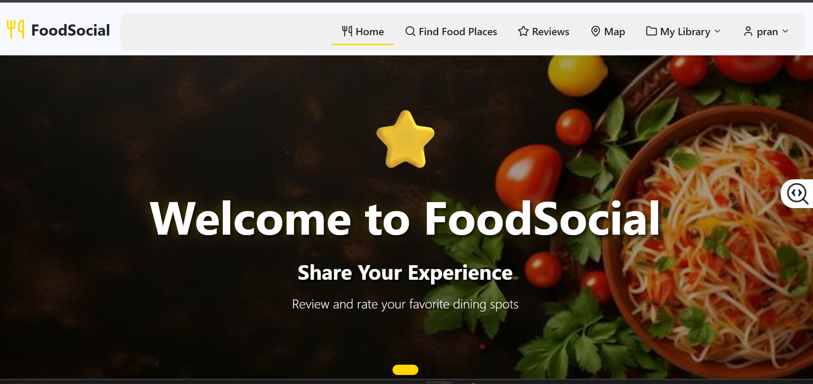
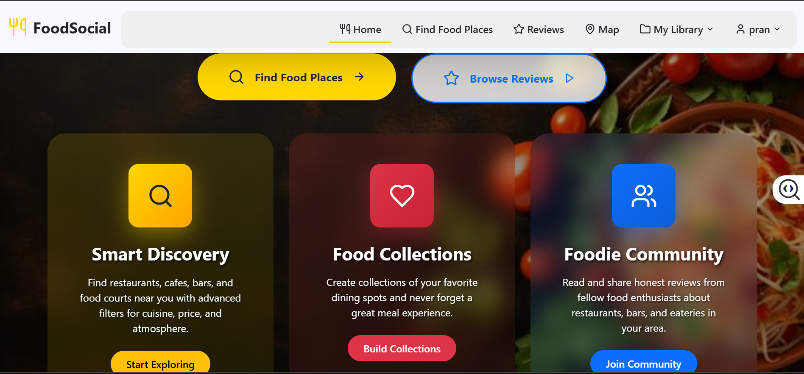
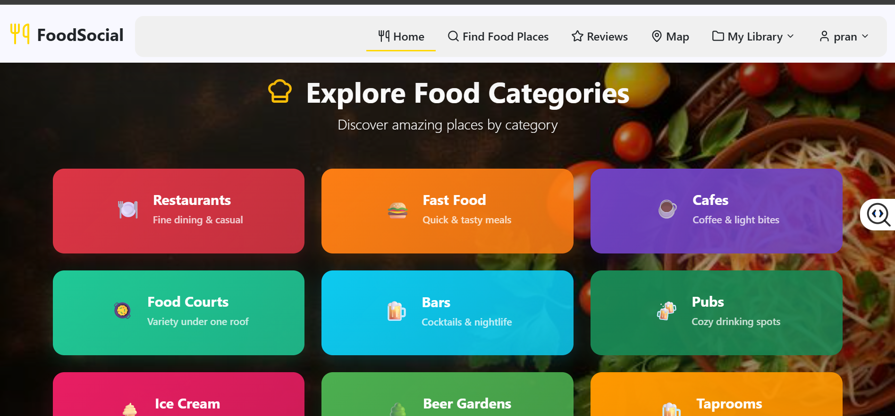
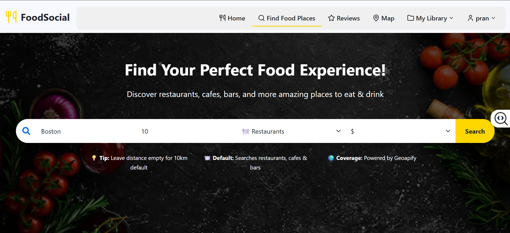
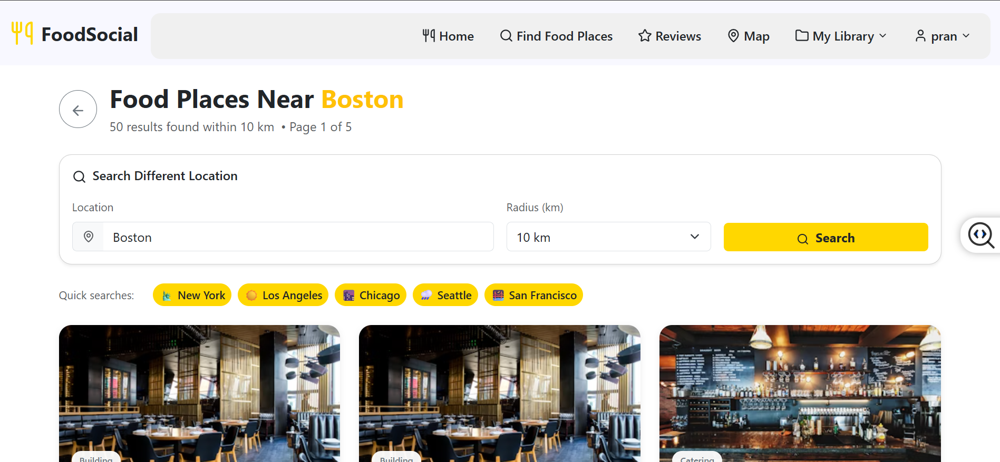
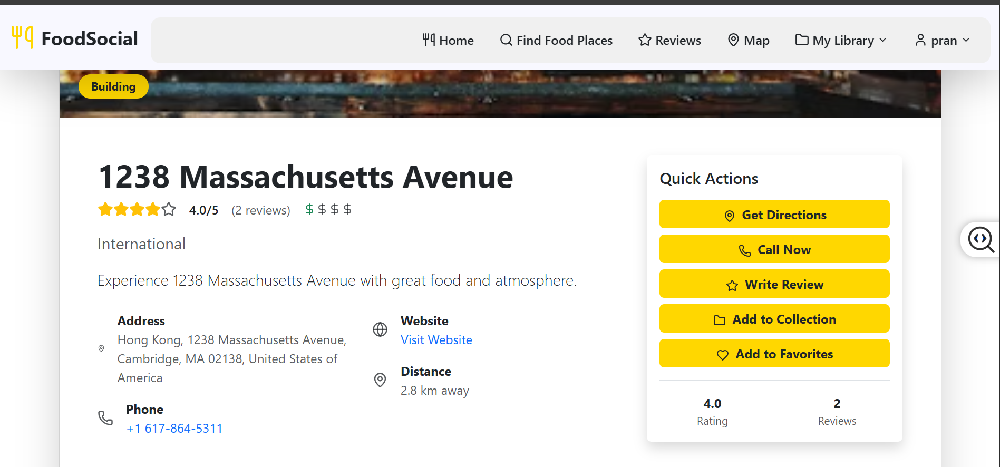
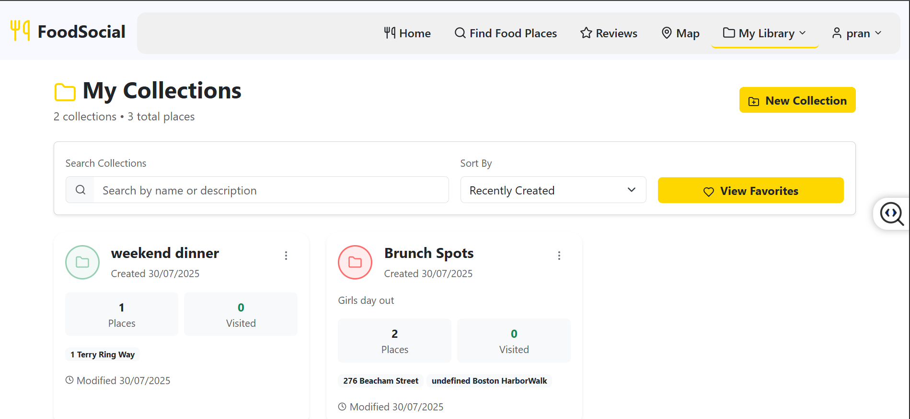
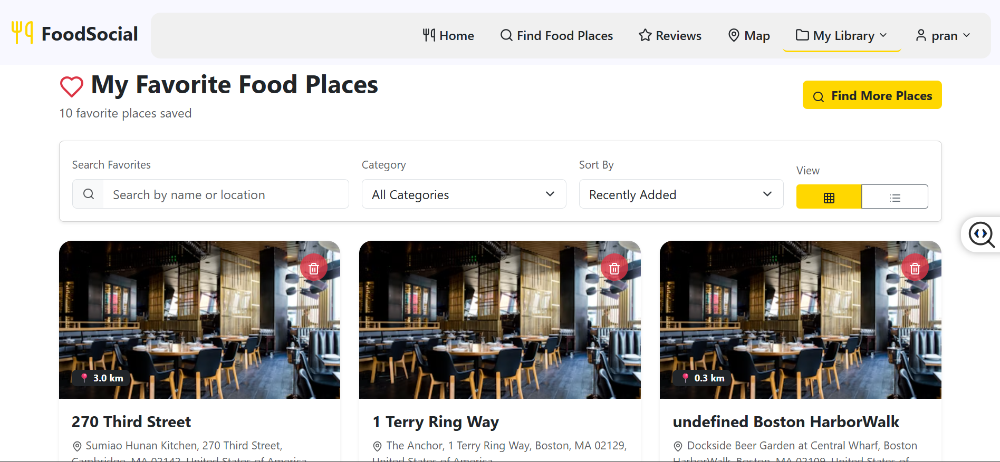
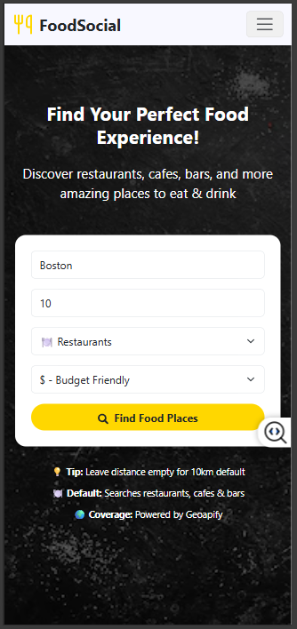
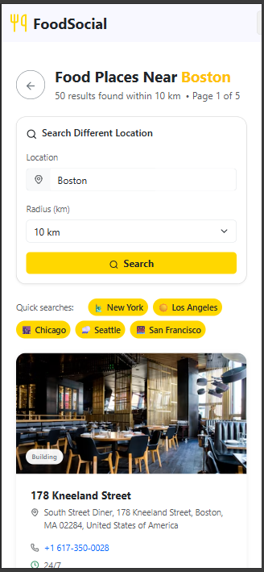

# 🍽️ FoodSocial

### A Full-Stack Social Food Discovery Platform

FoodSocial is a full-stack social platform for discovering restaurants, sharing food experiences, writing reviews, and organizing favorite places into collections.

It combines social-media functionality with real-world restaurant discovery using location-based data from Geoapify.

<p align="center">
  <a href="https://foodsocialapp.netlify.app">
    
  </a>
  <a href="https://github.com/rachana1707-S/FoodSocial">
    
  </a>
</p>

<p align="center">
  
  
  
  
  
  
</p>

---

## 📸 Application Preview

### 🏠 Social Feed

<p align="center">
  
  
  
</p>

<p align="center">
  Discover food experiences, restaurant reviews, and posts from the community.
</p>

---

### 📍 Restaurant Discovery

<p align="center">
  
  
  
</p>

<p align="center">
  Search and explore restaurants using real-world location data from Geoapify.
</p>

---

### ❤️ Collections & Favorites

<p align="center">
  
  
</p>

<p align="center">
  Save favorite restaurants and organize places into personalized collections.
</p>

---

### 📱 Mobile Experience

<p align="center">
  
  &nbsp;&nbsp;&nbsp;
  
</p>

<p align="center">
  Fully responsive experience across desktop, tablet, and mobile devices.
</p>

---

# ✨ Features

### 🔍 Restaurant Discovery

- Search nearby restaurants using real-world location data
- Browse restaurants by category
- Explore restaurants through interactive maps
- View restaurant details and reviews

### ⭐ Reviews & Social Features

- Create and edit restaurant reviews
- Share food experiences
- Browse reviews from other users
- Save favorite restaurants

### 📚 Collections

- Create personalized restaurant collections
- Add and remove restaurants
- Organize saved locations
- Manage favorites

### 👤 User Experience

- User registration and login
- JWT-based authentication
- Personal profiles
- Protected routes
- Responsive interface

---

# 🏗️ Architecture

```text
                        ┌─────────────────────┐
                        │      FoodSocial     │
                        └──────────┬──────────┘
                                   │
                  ┌────────────────┴────────────────┐
                  │                                 │
                  ▼                                 ▼
        ┌───────────────────┐             ┌───────────────────┐
        │   React Frontend  │             │  Express Backend  │
        │                   │             │                   │
        │ React Router      │◄───────────►│ REST APIs         │
        │ React Query       │    HTTP     │ JWT Auth          │
        │ Tailwind CSS      │             │ Controllers       │
        └───────────────────┘             └─────────┬─────────┘
                                                   │
                              ┌────────────────────┼────────────────────┐
                              │                    │                    │
                              ▼                    ▼                    ▼
                     ┌────────────────┐   ┌────────────────┐   ┌────────────────┐
                     │   PostgreSQL   │   │    Geoapify    │   │   Cloudinary   │
                     │                │   │                │   │                │
                     │ Users          │   │ Restaurants    │   │ Images         │
                     │ Reviews        │   │ Places         │   │ Uploads        │
                     │ Collections    │   │ Maps           │   │ Media          │
                     │ Favorites      │   │ Geolocation    │   │                │
                     └───────▲────────┘   └────────────────┘   └────────────────┘
                             │
                         Prisma ORM
```

---

# 🛠️ Tech Stack

## Frontend

| Technology | Purpose |
|---|---|
| React 18 | User interface |
| React Router | Client-side routing |
| React Query | Server state management |
| Tailwind CSS | Styling |
| React Hook Form | Form handling |
| Lucide React | Icons |

## Backend

| Technology | Purpose |
|---|---|
| Node.js | JavaScript runtime |
| Express.js | REST API |
| PostgreSQL | Relational database |
| Prisma ORM | Database access |
| JWT | Authentication |
| Cloudinary | Image management |
| Nodemailer | Email integration |

## External Services

| Service | Purpose |
|---|---|
| Geoapify Places | Restaurant discovery |
| Geoapify Maps | Location visualization |
| Geoapify Categories | Restaurant filtering |
| Cloudinary | Image storage |

---

# 🔄 How It Works

```text
User
  │
  ▼
React Interface
  │
  ├──── Search Restaurants ────► Geoapify API
  │
  ├──── Upload Images ─────────► Cloudinary
  │
  └──── Reviews / Collections
                │
                ▼
          Express REST API
                │
                ▼
            Prisma ORM
                │
                ▼
            PostgreSQL
```

### Example Flow

```text
Search for restaurants
        ↓
React sends location/query
        ↓
Backend communicates with Geoapify
        ↓
Restaurant data returned
        ↓
User selects restaurant
        ↓
Create review / favorite / collection
        ↓
Data stored in PostgreSQL
```

---

# 🔐 Authentication

FoodSocial uses JWT-based authentication to protect user-specific functionality.

```text
Register / Login
       ↓
Backend validates credentials
       ↓
JWT generated
       ↓
Client receives token
       ↓
Protected routes become available
```

Protected functionality includes:

- User profiles
- Reviews
- Favorites
- Collections
- Account management

Passwords are securely hashed before being stored.

---

# 📡 API Overview

### Authentication

```http
POST /api/auth/register
POST /api/auth/login
POST /api/auth/logout
GET  /api/auth/me
```

### Users

```http
GET  /api/users/profile
PUT  /api/users/profile
GET  /api/users/:id
```

### Restaurants & Reviews

```http
GET    /api/coffee-shops
GET    /api/coffee-shops/:id

POST   /api/reviews
GET    /api/reviews/:id
PUT    /api/reviews/:id
DELETE /api/reviews/:id
```

### Search

```http
GET /api/search/restaurants
GET /api/search/users
GET /api/search/nearby
GET /api/categories
```

### Collections & Favorites

```http
GET    /api/collections
POST   /api/collections
PUT    /api/collections/:id
DELETE /api/collections/:id

POST   /api/favorites
DELETE /api/favorites/:id
```

---

# 📁 Project Structure

```text
FoodSocial/
│
├── client/
│   ├── public/
│   │
│   └── src/
│       ├── components/
│       ├── context/
│       ├── pages/
│       ├── screenshots/
│       ├── tests/
│       ├── App.jsx
│       └── main.jsx
│
├── api/
│   ├── prisma/
│   │   ├── migrations/
│   │   └── schema.prisma
│   │
│   └── src/
│       ├── config/
│       ├── controllers/
│       ├── middleware/
│       └── routes/
│
├── README.md
└── .gitignore
```

---

# 🚀 Getting Started

## Prerequisites

Install:

```text
Node.js 16+
npm
PostgreSQL
Git
```

## 1. Clone the Repository

```bash
git clone https://github.com/rachana1707-S/FoodSocial.git
cd FoodSocial
```

## 2. Install Frontend Dependencies

```bash
cd client
npm install
```

## 3. Install Backend Dependencies

```bash
cd ../api
npm install
```

## 4. Configure Environment Variables

Create the required `.env` files.

### Backend

```env
DATABASE_URL=your_postgresql_connection_string
JWT_SECRET=your_jwt_secret

GEOAPIFY_API_KEY=your_geoapify_api_key

CLOUDINARY_CLOUD_NAME=your_cloud_name
CLOUDINARY_API_KEY=your_cloudinary_key
CLOUDINARY_API_SECRET=your_cloudinary_secret
```

### Frontend

```env
VITE_API_URL=http://localhost:5000/api
VITE_GEOAPIFY_API_KEY=your_geoapify_api_key
```

> Never commit `.env` files or API secrets to GitHub.

---

# 🗄️ Database Setup

Generate the Prisma client:

```bash
cd api
npx prisma generate
```

Run migrations:

```bash
npx prisma migrate dev
```

Optional database viewer:

```bash
npx prisma studio
```

---

# ▶️ Run Locally

### Backend

```bash
cd api
npm run dev
```

### Frontend

Open another terminal:

```bash
cd client
npm run dev
```

The frontend will normally run at:

```text
http://localhost:5173
```

---

# 🌐 Deployment

### Frontend

The frontend can be deployed using Netlify or Vercel.

### Backend

The Express API can be deployed using services such as Render or Railway.

### Database

Use a hosted PostgreSQL database and configure the production `DATABASE_URL` through environment variables.

---

# 🧪 Testing

Frontend tests are organized under:

```text
client/src/tests/
```

Run the available tests with:

```bash
npm test
```

or the test command configured in `package.json`.

---

# 🔮 Future Improvements

- [ ] Real-time notifications
- [ ] More advanced social interactions
- [ ] Recommendation system
- [ ] Improved restaurant ranking
- [ ] Collaborative collections
- [ ] Additional automated testing
- [ ] Performance monitoring
- [ ] CI/CD pipeline

---

# 👩‍💻 Author

### Rachana Sudhakar

MS Computer Science  
Northeastern University

📍 Boston, Massachusetts

[](https://github.com/rachana1707-S)

[](https://linkedin.com/in/rachanasudhakar)

---

<p align="center">
  <b>Built with React, Node.js, PostgreSQL, Prisma, and Geoapify.</b>
</p>

<p align="center">
  ⭐ If you find FoodSocial interesting, consider starring the repository.
</p>
